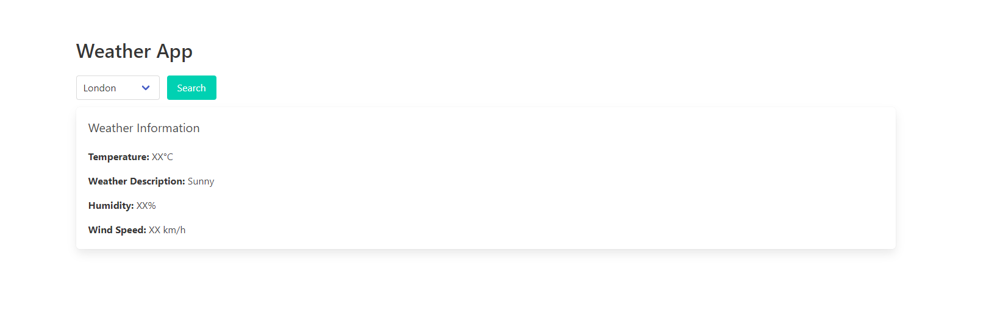

# react-workshop
Hands-on learning with React components, state management, hooks, routing, testing, and best practices.

## 12-Day Journey
Over the course of 12 days, we dive deep into various topics, dedicating each day to an in-depth exploration of a specific aspect of React.

### Lesson 1
* Single Page Applications (SPA)
* React's Virtual DOM concept.
* Setting up the development environment.
* Understanding JSX and how it differs from HTML.
* Creating our first React component.

### Lesson 2
* Understanding Props.
* Passing and using Props in components.

### Lesson 3
* Understanding Component State and its importance.
* Understanding React component lifecycle.

### Lesson 4
* How to handle user interactions through events.

### Lesson 5
* Using JavaScript operators like 'if' and the conditional (ternary) operator to create elements representing the current state.
* Hiding and showing elements.

### Lesson 6
* Rendering multiple components using '.map()' and '.filter()'.
* Importance of keys in list items.

### Lesson 7
* Controlled components.
* Form handling and validations.

### Lesson 8
* Introduction to Context API.
* How to use 'useReducer' for complex state management.

### Lesson 9
* Understanding hooks in React.
* Custom hooks.

### Lesson 10
* Introduction to React Router.
* Setting up routing for our application.
* Switch, Route, Link components.

### Final Project Weather App (2 Days)

Create a simple weather application that allows users to search for the current weather conditions of a particular city. The application will display the temperature, weather description, and other relevant information.



#### Steps:
1. Set up a new React project using Create React App.

2. Install the required dependencies and any other libraries you may need.

3. Design the layout of your application. Create a search bar component and a weather display component.

4. Implement the UI components for the search page and the weather display page.

5. Define a state variable to store the weather information, we should auto load the last selected city on reload.

6. Implement the search functionality:

    a. Create a component for the search bar.
    b. Use the useState hook to manage the search query state.
    c. Handle user input changes (dropdown) and perform data fetching using the useEffect hook and fetch API.
    d. Update the weather data state with the fetched information.

7. Implement the weather display:

    a. Create a component to display the weather information.
    b. Access the weather data from the states and display it in the component.
    c. Style your application using CSS or a UI library of your choice.

8. Test your application to ensure that the search functionality and weather display work correctly.

**Note**: you can use the OpenWeatherMap API. OpenWeatherMap provides a free API that allows you to access current weather data for various locations around the world. Here's how you can use it in the project:

```js
const apiKey = 'YOUR_API_KEY';
const city = 'London'; // Replace with the desired city

fetch(`https://api.openweathermap.org/data/2.5/weather?q=${city}&appid=${apiKey}`)
  .then(response => response.json())
  .then(data => {
    // Handle the response data
    console.log(data);
  })
  .catch(error => {
    // Handle any errors
    console.error('Error fetching weather data:', error);
  });

```

